# Home Page

**Website**: [https://react-movie-lab.netlify.app](https://react-movie-lab.netlify.app/)

**Gitlab**: https://gitlab.com/Manuel-yang/moviesapp-ci.git

**Youtube**:  https://youtu.be/_mN0xKnGQh8

**Github**: https://github.com/Manuel-yang/react-movie-labs.git

## Appbar

I change the siteHeader into the Appbar through the API below

But you should input the exact movie name to search

> **GET** /search/company

On the left of the search bar are three links that navigate to different pages.


## Carousel

At the top, I use a Carousel to show what is movies on trending through the API below

> **GET** /trending/{media_type}/{time_window}

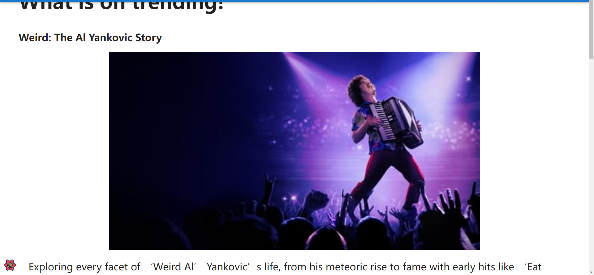


## Filter Card

Filter card have the same functions in the lab

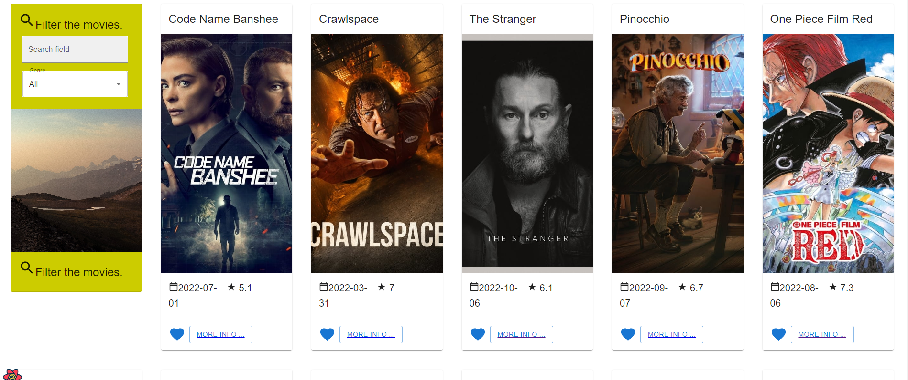


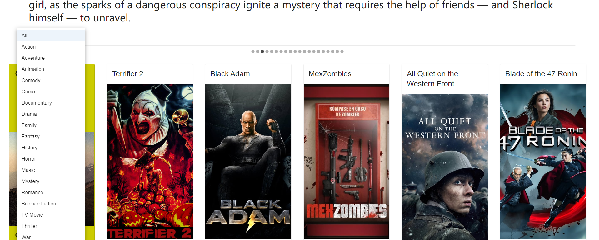


## Pagination

When you scroll down to the bottom of the page, the web will request the second page of movie information through API and render them

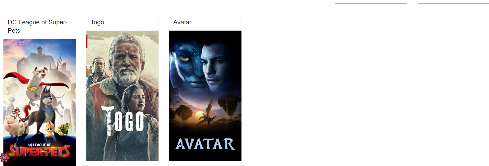


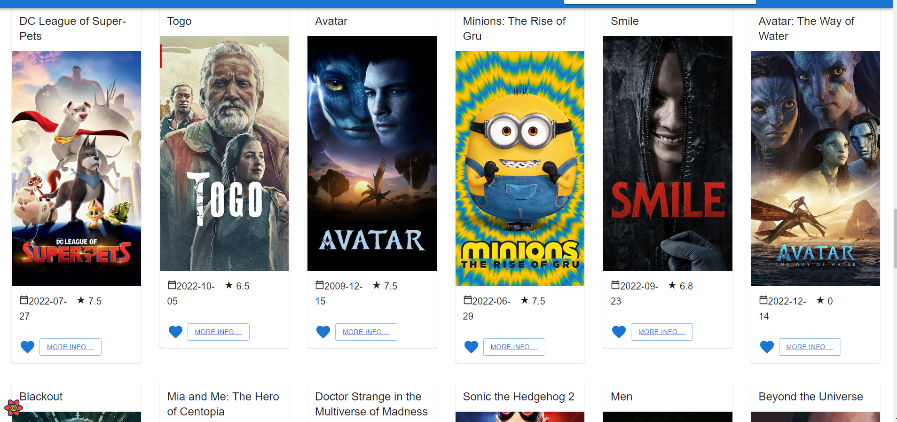


# Movie detail

## Movie's details

At the top is the movie's backdrops 


Show the movie's details through the API below

> **GET** /movie/{movie_id}

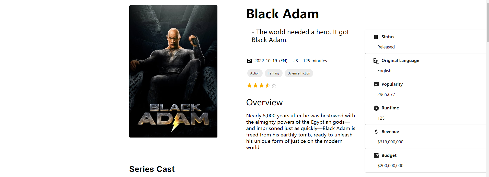


## Movie's cast

Get the credits of movie through the API below

Display the cast of movie

> **GET** /movie/{movie_id}/credits

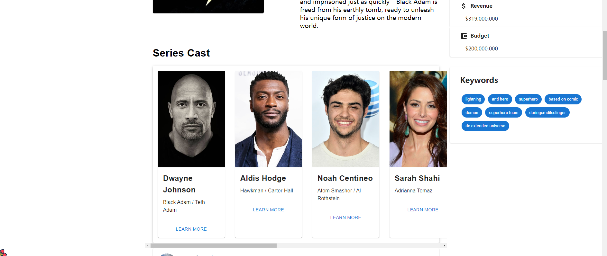


## Movie's keywords

Get the movie's keywords through the API below

Display all the keywords on the right

> **GET** /movie/{movie_id}/keywords


## Comments

Get reviews through the API below

This component displays the avatar, rate, date of the comment, review, and the user name

> **GET** /movie/{movie_id}/reviews

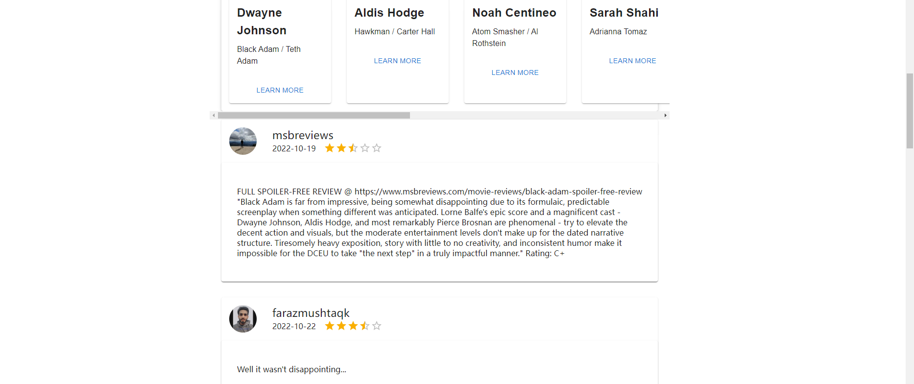


# Actor details


## Actor information

Click the "Learn more" button below the actor card and this will navigate to the actor details page

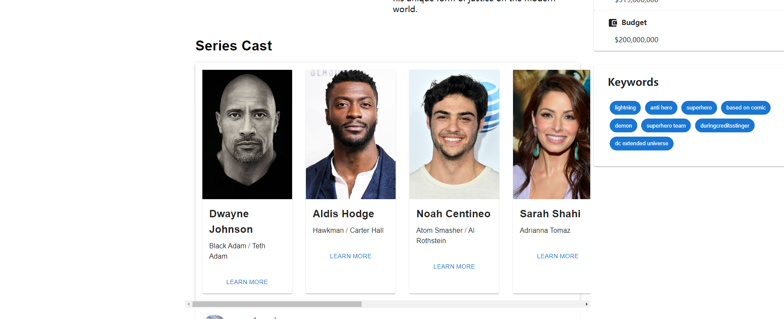


Notice that the URL has the actor's id in order to get the actor's details

It is implemented through the API below

This page displays the information and biography of the actor

> **GET** /person/{person_id}

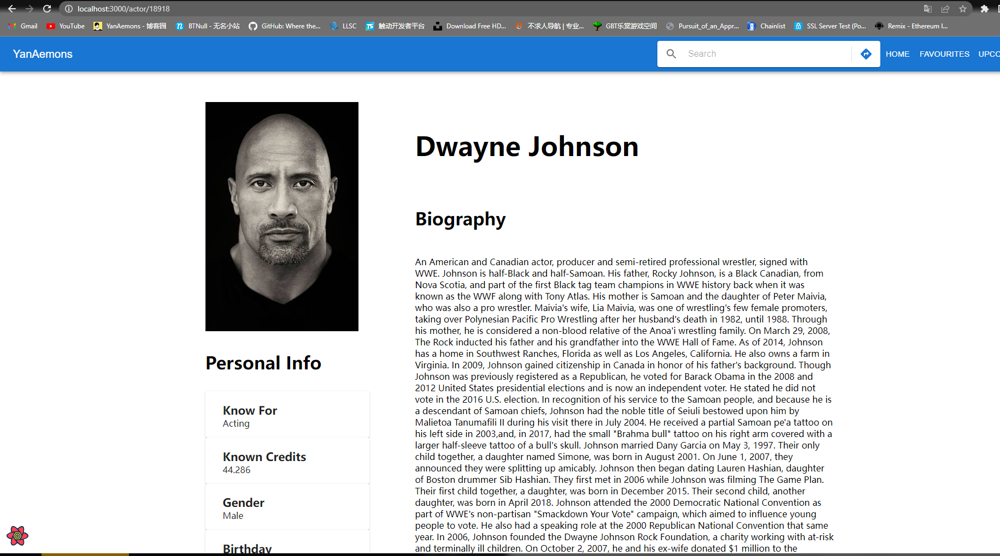


## Known for

This block displays the movies that the actor acted in the past

> **GET** /person/{person_id}/combined_credits

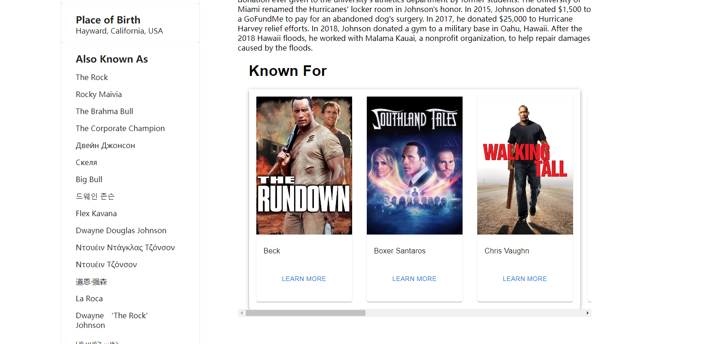


Click the "Learn more" button under the card, it will navigate you to the movie detail page

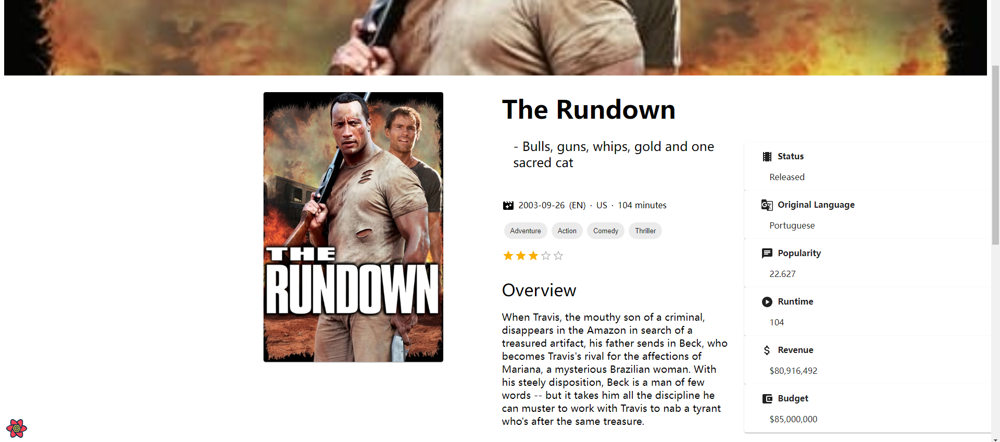


# Setup requirements

In this project, NPM is used to manage the packages. Use ```npm install``` to install all the dependencies


Dotenv is used to manage the Api key. Create a ```.env``` file under root folder and input Api key in it. Add it into ```.gitignore``` to ignore this file when uploading

```
REACT_APP_TMDB_KEY=<APIkey>
FAST_REFRESH=<boolean>
```


### Command

- ```npm run start:ci```: Start e2e testing
- ```npm run start:component```: Start component testing
- ```npm run start```: Start the project
- ```npm run build```: Bundle the project


# E2E Test


- ### Base tests

  - The Discover Movies page
    - displays the page header and 20 movies
    - displays the correct movie titles
    - after scroll to the bottom of the page, it should have 40 movies
  - The movie details page
    - displays the movie title, overview and genres
    - displays the movie status, original language, Popularity, Runtime, Revenue, Budge
    - displays the movie keyword
    - displays the series cast
    - displays the review about the movie

- ### ActorDetail

  - The actor details page
    - displays the actor profile site
    - displays the actor name and biography
    - displays the movies that actor involved

- ### Favourites

  - The favourites feature
    - selected movie card shows the red heart
  - The favourites page
    - only the tagged movies are listed

- ### Filtering

  - By movie genre
    - show movies with the selected genre

- ### Navigation

  - From the home page to a movie's details
    - navigates to the movie details page and change browser URL
  - use search will navigate to the movie's deatils
    - navigates to the movie details page through search
  - input invalid movie's name
    - should catch the error
  - navigation should navigate to different page
    - should navigate to facourite page after click favourite link

- ### Upcoming tests

  - The upcoming page
    - displays the page header and 20 movies
    - displays the correct movie titles


## Error/Exception


In this project, I use the structure below to handle the error


```
cy.on("uncaught:exception", () => {
	.....
	if(err.message.includes("...")) {
		throw new Error("....")
	}
})
```


## Cypress Custom commands


Code below is used to immitate user press "enter" and search bar will navigate user to the movie detail page

```
Cypress.Commands.add('enter', () => {
  cy.get("#searchIcon").click()
})
```


# Component testing

- SiteHeader.cy.js
  - contain logo name
  - can input info in search bar
  - click home button
  - click favourites button
  - click upcoming button


# Branch


- basic-ci-config
- caching-in-ci
- cypress4actorDetail
- cypress4homePage
- cypress4moviedetail
- demobranch
- **develop (important)**
  - commit in develop branch
- **main (important)**
  - merge develop branch to main branch
- master
- tests-in-ci


# Pipeline

Stages contains:

- install (main/develop)
- build (main/develop)
- test (main)
  - e2e-test
  - component-test

```
image: node:latest

# Pipeline
stages:
  - install
  - build
  # - exercise_job
  - test

....


# Jobs 
install_dependencies:
  stage: install
  script:
    - npm ci --cache .npm --prefer-offline
  artifacts:
    paths:
      - node_modules/

bundle_app:
  stage: build
  script:
    - npm run build
  artifacts:
    paths:
      - build/

# exercise_job:
#   stage: exercise_job
#   only:
#     - main
#   script:
#     - echo "New job for exercise"

e2etest:
# Node docker image with Cypress and Chrome pre-installed
  image: cypress/browsers:node12.14.1-chrome85-ff81
  stage: test
  only:
    - main
  script:
    - echo "Run tests in headless mode"
    - npm run start:ci
    

test4component:
# Node docker image with Cypress and Chrome pre-installed
  image: cypress/browsers:node12.14.1-chrome85-ff81
  stage: test
  only:
    - main
  script:
    - echo "Run tests for component"
    - npm run start:component

....
```


# Continuous Integration

**Website**: [https://react-movie-lab.netlify.app](https://react-movie-lab.netlify.app/)

Netify are used in project to implement the auto-deployment(main)


# Bundling & Code splitting

```lazy``` and ```Suspense``` are used in pages to load in parallel


```react
import React, {useState, useEffect, lazy, Suspense} from "react";
...
const AcotrProfile = lazy(() => import('../components/actorProfile'))
const ActorProfileSite = lazy(() => import('../components/actorProfileSite'))
...
  return(
    <>
      <Container>
        <Grid container >
          <Suspense>
            <Grid item xs={4}>
              <ActorProfileSite details={details}/>
            </Grid>
            <Grid item xs={8}>
              <AcotrProfile details={details} combinedCredits={combinedCredits}/>
            </Grid>
          </Suspense>
        </Grid>
      </Container>
    </>
  )
```

